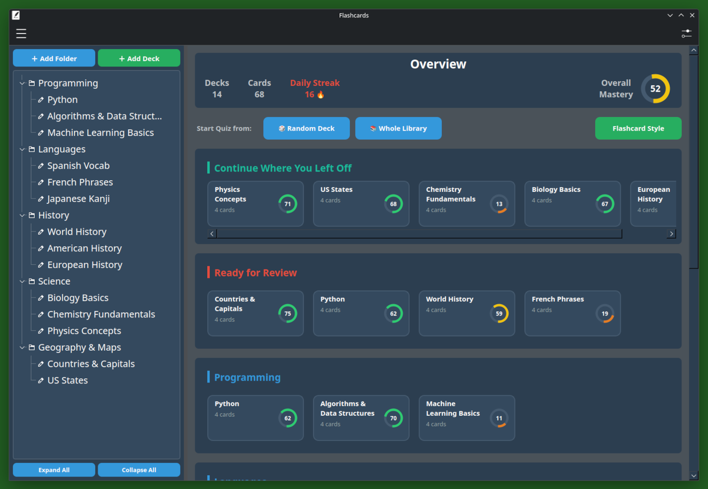
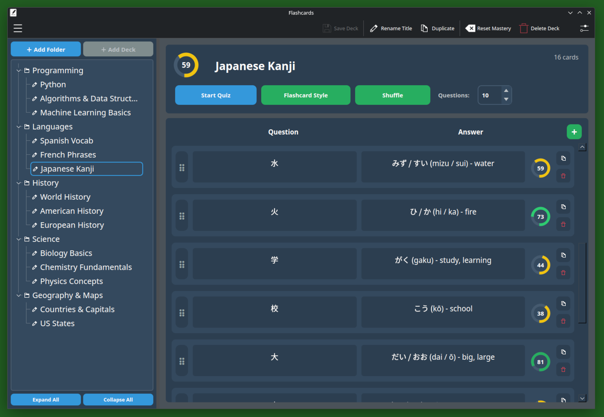
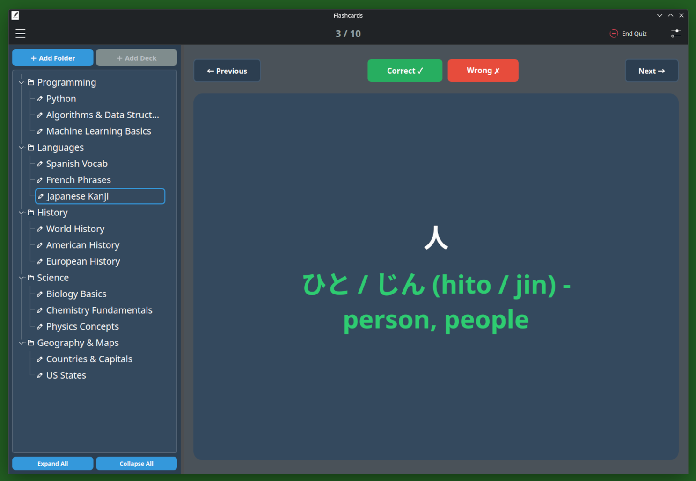
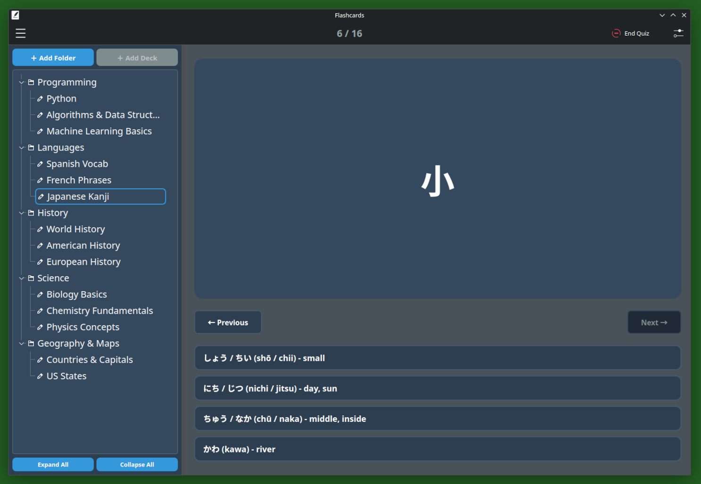

<<<<<<< HEAD
# Flashcards by Ethan (v1.1)

**A clean, modern, and distraction-free flashcard + quiz app.**


---

## ✨ Features

- **Rich Organization** - Folders, subfolders, and decks with full drag & drop support
- **Two Study Modes** - Classic flashcard mode + Multiple Choice
- **Mastery System** - Per-card mastery tracking with beautiful radial progress indicators
- **Daily Streak** - Built-in streak counter to keep you motivated
- **Home Dashboard** - Quick overview of your library, stats, and recent decks
- **Keyboard Friendly** - Full keyboard navigation and shortcuts
- **Modern UI** - Clean dark theme designed for long study sessions
- **Export / Import** - Backup and restore your entire library

---

<<<<<<< HEAD

| Home Page | Deck Editor |
|----------|-------------|
|  |  |

| Flashcard Quiz | Multiple Choice Quiz |
|----------------|----------------------|
|  |  |

---

## 📥 Downloads & Installation

### Debian / Ubuntu

Download the latest `.deb` from the [Releases page](https://github.com/ethan-mccall/flashcards-by-ethan/releases) and run:

```bash
sudo dpkg -i flashcards-by-ethan_*.deb
sudo apt install -f
```
To update an existing `.deb`, run:
```bash
wget https://github.com/ethan-mccall/flashcards-by-ethan/releases/latest/download/flashcards-by-ethan_1.1_amd64.deb
sudo dpkg -i flashcards-by-ethan_*.deb
sudo apt install -f
```
To uninstall `.deb`, run:
```bash
sudo dpkg -r flashcards-by-ethan
or
sudo dpkg --purge flashcards-by-ethan
```

### Snap
Download the latest `.snap` from the [Releases page](https://github.com/ethan-mccall/flashcards-by-ethan/releases) and run:
```bash
sudo snap install flashcards-by-ethan_1.1_amd64.snap --dangerous
```
><h6>snap currently waiting in manual review.

To uninstall `.snap`, run:
```bash
sudo snap remove flashcards-by-ethan
or
sudo snap remove --purge flashcards-by-ethan
```
